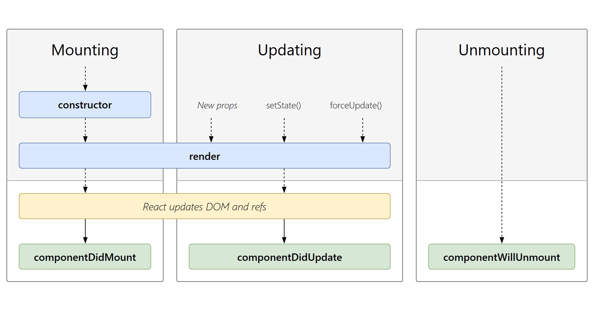
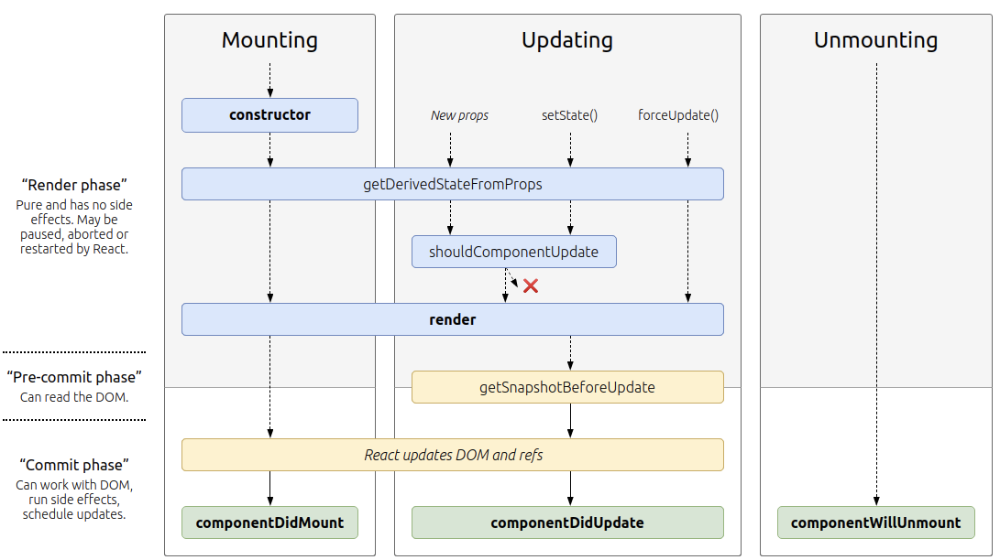

# When do we use React LifeCycle?

먼저, 리액트의 생명주기가 어떤 점에서 필요하고, 무엇인지에 대해 알아봅시다 😁

사용자와 함께하는 동적인 페이지를 만들기 위해 `state`와 `props`는 사용자에 어떤 특정 행동에 의해 값이 변합니다. 사용자가 사이트에 들어오기 전에는 특정한 API를 호출해서 데이터를 가져와야 하는 경우가 필요할 수도 있습니다.

리액트에서는 `DOM(Document Object Model)`에서 특정한 시간에 특정한 행동을 일어나게 할 수 있도록 생명주기를 만들었다고 생각합니다. 즉, 리액트에서 말하는 생명주기는 내가 원하는 것과 화면에 렌더링하는 구성 요소들을 일치시킬 수 있도록 `DOM`을 관리하는 일종의 수단이 됩니다👍

## What is React Life Cycle?

리액트에서 생명주기는 크게 3단계로 나눌 수 있습니다. 각 과정의 순서는 Mounting → Updating → Unmounting 과정으로 진행됩니다. 각각의 과정에서 어떤 것을 할 수 있는지에 대해 알아봅시다🧐



## Mounting

Mounting은 `DOM`에 Node를 추가하는 작업입니다. Node를 만들고, 사이트에 불러오는 역할을 해줍니다. Mounting은 `constructor`, `render`, `componentDidMount`으로 순차적으로 진행됩니다.

### Constructor

리액트에서 생성자는 DOM에 추가되기 전에 실행이 되며 가장 먼저 실행됩니다. 개인 환경에서 초기값을 설정해줄 때 사용합니다.

- `this.state`에 객체를 할당하여 [지역 state](https://ko.reactjs.org/docs/state-and-lifecycle.html)를 초기화할 수 있습니다.
- 인스턴스에 [이벤트 처리](https://ko.reactjs.org/docs/handling-events.html) 메서드를 바인딩할 수 있습니다.

### Render

리액트에서 정말 정말 중요한 친구입니다. 리액트에서 대부분의 작업을 수행하고 있고, 주로 컴포넌트를 JSX로 반환하는 역할을 합니다.

`Render`는 항상 순수해야 합니다. 기존에 사용하던 `state`가 변하지 않아야 컴포넌트의 동작이 이해하기 편하게 작동이 될 것입니다.

### ComponentDidMount

여러 컴포넌트가 `Render`된 후에 호출이 됩니다. 주로 데이터를 상호작용하기 위해서 데이터를 로드할 때 사용합니다.

### GetDerivedStateFromProps

여기서 생각해볼 할 문제가 있습니다. `props`에 의존하여 `state`를 변경하여 쓰고 싶다면 어디에 넣어줘야 할까요?

`Constructor`에 넣는 것은 새로운 `state`를 만드는 행위입니다. `ComponentDidMount`에 넣는 것은 이 때 값이 변경되는 상황이 필요하다면 이미 늦은 상태입니다. **그래서 `Render`가 되기 전에 실행이 되는 생명주기가 있습니다.**

리액트 16.3 버전에서는 이를 위해서 `componentWillReciveProps`를 사용했었는데, 17 버전부터는 `getDerivedStateFromProps`로 바꿔서 사용합니다.

두 개의 주요 차이는 함수 내에서 `setState`를 할 수 있냐 없냐에 차이가 있다고 보면 됩니다.전자는 가능하고, 후자는 가능하지 않습니다. 전자는 이제 거의 사용하지 않으니 후자에 대해 조금 알아봅시다.

`getDerivedStateFromProps`는 `static` 메서드로 `this`로 접근 할 수 없으며, 다른 클래스 메서드에도 접근할 수 없습니다. 상태를 바꾸는 유일한 방법은 객체를 반환하는 것이고, 바꾸기 싫다면 `Null`을 반환하면 됩니다.

사용시 주의할 사항이 있는데, `getDerivedStateFromProps`는 Render가 될 때마다 매 번 실행이 되고, 필요없는 상황에서 사용할 경우도 있습니다. 그래서 정말 드문 경우에만 사용하는걸 추천하며 아래에 해당되는 내용이 있으면 리액트에서 제시하는 대안을 사용하면 좋습니다.

- props 변화에 대응한 **부수 효과를 발생**시켜야 한다면 (예를 들어, 데이터 가져오기 또는 애니메이션), `[componentDidUpdate](https://ko.reactjs.org/docs/react-component.html#componentdidupdate)` 생명주기를 대신해서 사용하세요.
- **props가 변화했을 때에만 일부 데이터를 다시 계산** 하고 싶다면, [Memoization Helper](https://ko.reactjs.org/blog/2018/06/07/you-probably-dont-need-derived-state.html#what-about-memoization)를 대신해서 사용하세요.
- **props가 변화할 때에 일부 state를 재설정** 하고 싶다면, [완전 제어 컴포넌트](https://ko.reactjs.org/blog/2018/06/07/you-probably-dont-need-derived-state.html#recommendation-fully-controlled-component) 또는 `[key`를 사용하는 완전 비제어 컴포넌트\]([https://ko.reactjs.org/blog/2018/06/07/you-probably-dont-need-derived-state.html#recommendation-fully-uncontrolled-component-with-a-key)로](https://ko.reactjs.org/blog/2018/06/07/you-probably-dont-need-derived-state.html#recommendation-fully-uncontrolled-component-with-a-key)%EB%A1%9C) 만들어서 사용하세요.

## Updating

Updating은 말 그대로 무언가 바뀌었을 때 호출이 됩니다.

### GetDerivedStateFromProps(Update)

위와 동일합니다. 하지만 업데이트가 되지 않았는데도 실행이 되는 친구니까 항상 조심해야 합니다. 최대한 사용을 자제합시다.

### Render(Update)

위와 동일합니다. 업데이트가 되고 나서 다시 보이게 할려면 `Render`가 다시 되어야 보입니다.

### ComponentDidUpdate

 Re-rendering이 완료되고 직후에 호출되는 친구입니다. 즉, 사용자의 환경에는 이미 바뀐 상태가 적용되어있을 때 실행되는 메서드라고 생각하면 됩니다. 여기서는 이전 상태에 접근할 수 있습니다. 주로 자동 저장 기능과 같은 업데이트를 통해 `DOM`에 커밋 된 변경된 사항과 관련된 작업을 수행하려는 경우에 사용됩니다.

 여기서 이전 상태에 접근 하기 위해서 `getSnapshotBeforeUpdate` 를 이용해서 같이 사용합니다. 컴포넌트의 값이 변하기 직전의 `DOM`의 상태를 가져와서 특정 값을 반환한다면 `ComponentDidMount`를 실행 시키면 됩다.

- 실제 사용하는 코드

```javscript
    getSnapshotBeforeUpdate(prevProps, prevState) {
        // DOM 업데이트가 일어나기 직전의 시점입니다.
        // 새 데이터가 상단에 추가되어도 스크롤바를 유지해보겠습니다.
        // scrollHeight 는 전 후를 비교해서 스크롤 위치를 설정하기 위함이고,
        // scrollTop 은, 이 기능이 크롬에 이미 구현이 되어있는데,
        // 이미 구현이 되어있다면 처리하지 않도록 하기 위함입니다.
        if (prevState.array !== this.state.array) {
          const { scrollTop, scrollHeight } = this.list;
    
          // 여기서 반환 하는 값은 componentDidMount 에서 snapshot 값으로 받아올 수 있습니다.
          return {
            scrollTop,
            scrollHeight
          };
        }
      }
    
      componentDidUpdate(prevProps, prevState, snapshot) {
        if (snapshot) {
          const { scrollTop } = this.list;
          if (scrollTop !== snapshot.scrollTop) return; // 기능이 이미 구현되어있다면 처리하지 않습니다.
          const diff = this.list.scrollHeight - snapshot.scrollHeight;
          this.list.scrollTop += diff;
        }
      }
```

### ShouldComponentUpdate

 여기서도 생각해볼 부분이 당연히 있습니다. 그렇다면 상태가 바뀔 때마다 Re-Rendering 되는게 맞을까요? 당연히 코스트가 너무 커지기 때문에 아니라고 얘기할 수 있습니다. 그래서 `ShouldComponentUpdate`가 존재 합니다.

**오직 최적화만을 위한 생명주기입니다.**

 이 메서드는 `props` 또는 `state`가 새로운 값으로 갱신되어서 Rendering이 발생하기 직전에 호출됩니다. 기본값은 true며 이 메서드는 초기 렌더링 또는 `forceUpdate`가 사용될 때에는 호출되지 않습니다. 사용 할려면 이전값과 현재 값을 비교해서 false를 반환하게 만들어 줘야 합니다.

`shouldComponentUpdate` 내에서는 깊은 동일성 검사를 수행하거나 `JSON.stringify`를 사용하는 것을 권하지 않습니다. 아주 비효율적이며 성능을 떨어트릴 수 있습니다.

하지만, 렌더링을 방지하는 목적으로 사용할 경우 버그로 이어질 수 있다고 합니다.

리액트에서 대신에 [PureComponent](https://ko.reactjs.org/docs/react-api.html#reactpurecomponent)를 사용하는 것이 좋다고 말합니다. `PureComponent`는 `props`와 `state`에 대하여 얕은 비교를 수행하고, 해야 할 갱신 작업을 건너뛸 확률을 낮춥니다.

## UnMounting

컴포넌트가 `DOM`에서 제거될 때 사용됩니다.

### ComponentWillUnMounting

Clean하는 과정이다. 일반적으로, 네트워크의 요청이나 이벤트 리스너, 더이상 필요하지 않는 요소들을 제거할 때 사용합니다.

전체적으로 이를 나타내보면 아래와 같이 됩니다.



## Error Handling in React

위에서 다룬 생명주기가 아니라 추가로 Error발생시 실행되는 메서드가 있습니다.

### getDerivedStateFromError

이 메서드는 하위의 자손 컴포넌트에서 오류가 발생했을 때 호출됩니다. 이 메서드는 매개변수로 오류를 전달받고, 갱신된 state 값을 반드시 반환해야 합니다.

해당 메서드는 `render`단계에서 실행됩니다. 그러므로 오류 로그 기록을 한다는 등 부수적인 효과를 넣지 말아야 합니다.

- 사용예시

```javascript
    class ErrorBoundary extends React.Component {
      constructor(props) {
        super(props);
        this.state = { hasError: false };
      }
    
      static getDerivedStateFromError(error) {
      return { hasError: true };  
     }
    
     render() {
        if (this.state.hasError) {
       return <h1>Something went wrong.</h1>;    
      }
      return this.props.children;
      }
    }
```

### componentDidCatch

이 메서드는 자손 컴포넌트에서 오류가 발생되었을 때 호출되며, 2개의 매개변수를 사용합니다.

1. `error` - 발생한 오류
2. `info` - 어떤 컴포넌트가 오류를 발생시켰는지에 대한 정보를 포함한 `componentStack` 키를 갖고 있는 객체
3. 해당 메서드는 `커밋`단계에서 실행됩니다. 따라서 부수적인 효과를 넣어도 됩니다.

- 사용예시

```javascript
    componentDidCatch(error, info){
     logComponentStackToMyService(info.componentStack);
    }
```

## React LifeCycle in Functional Component

그렇다면 리액트에서 최근에 대다수가 주력으로 사용하게 된 함수형 컴포넌트에서는 생명주기가 어떻게 될까요?

결론부터 말하자면 앞서 알아봤던 3개의 상태에서 각각 마지막으로 호출되는`componentDidMount`와 `componentDidUpdate`, `componentWillUnmount` 를 `useEffect` 하나에 다 담아놓았습니다.

- 사용 코드를 살펴보면 다음과 같습니다.

```javascript
    useEffect(() => {
      function handleStatusChange(status) {
        setIsOnline(status.isOnline);
      }
    
      ChatAPI.subscribeToFriendStatus(props.friend.id, handleStatusChange);
      return () => {
        ChatAPI.unsubscribeFromFriendStatus(props.friend.id, handleStatusChange);
      };
    }, [props.friend.id]); // props.friend.id가 바뀔 때만 재구독합니다.
```

`useEffect`가 실행되는 시점은 다음과 같다.

1. 페이지에 들어오면 `componentDidMount`의 역할로 실행이 된다.
2. `props.friend.id`가 변할 때마다 `componentDidUpdate`의 역할이 된다.
3. 페이지에 나가게 되면 `componentWillUnmount`의 역할이 된다.

- 더 가시적으로 본다면 다음과 같습니다.

```javascript
    // { friend: { id: 100 } } state을 사용하여 마운트합니다.
    ChatAPI.subscribeToFriendStatus(100, handleStatusChange);     // 첫번째 effect가 작동합니다.
    
    // { friend: { id: 200 } } state로 업데이트합니다.
    ChatAPI.unsubscribeFromFriendStatus(100, handleStatusChange); // 이전의 effect를 정리(clean-up)합니다.
    ChatAPI.subscribeToFriendStatus(200, handleStatusChange);     // 다음 effect가 작동합니다.
    
    // { friend: { id: 300 } } state로 업데이트합니다.
    ChatAPI.unsubscribeFromFriendStatus(200, handleStatusChange); // 이전의 effect를 정리(clean-up)합니다.
    ChatAPI.subscribeToFriendStatus(300, handleStatusChange);     // 다음 effect가 작동합니다.
    
    // 마운트를 해제합니다.
    ChatAPI.unsubscribeFromFriendStatus(300, handleStatusChange); // 마지막 effect를 정리(clean-up)합니다.
```

그런데 사실 class형태에서 생명주기와 다른 부분이 있습니다. useEffect는 render가 된 후에 실행이 됩니다.

대부분의 작업이 브라우저에서 화면을 업데이트하는 것을 차단해서는 안되기 때문입니다. 실제로 이러한 동작 방식은 웬만한 경우에 더 효율적으로 작용할 것입니다.

하지만 사용자에게 전달해야 하는 값 중에 변경해서 사용해야 하는 값이 있다면 이를 방지해야 합니다.

그래서 `useLayoutEffect`를 사용합니다. 이는 스크롤 위치를 얻어오거나 다른 DOM 엘리먼트의 스타일을 조작할 때 사용할 때 효율적입니다.

### 전체적인 생명주기


### Others LifeCycle in React Functional Component

그렇다면 함수형 컴포넌트에서는 다른 생명주기가 필요하다면 사용할 수 없는것일까요?

`getDerivedStateFromProps`를 확인해 봅시다. 이것은 기존의 상태를 저장하는 변수를 하나 만들어서, 비교를 해주면 됩니다.

- 사용 예시

```javascript
    function ScrollView({row}) {
      const [isScrollingDown, setIsScrollingDown] = useState(false);
      const [prevRow, setPrevRow] = useState(null);
    
      if (row !== prevRow) {
        // 마지막 렌더링 이후 행이 변경되었습니다. isScrollingDown을 업데이트합니다.
        setIsScrollingDown(prevRow !== null && row > prevRow);
        setPrevRow(row);
      }
    
      return `Scrolling down: ${isScrollingDown}`;
    }
```

`shouldComponentUpdate`를 확인해 봅시다. 이것은 `React.Memo`로 래핑해서 `prop`를 얇게 비교할 수 있습니다. 혹은 `useMemo`를 이용해서 개별 자식들을 최적화 시켜줄 수 있습니다.

- 사용 예시

```javascript
    const Button = React.memo((props) => {
      // 당신의 컴포넌트
    });
    
    function Parent({ a, b }) {
      // 'a'가 변경된 경우에만 다시 렌더링 됩니다:
      const child1 = useMemo(() => <Child1 a={a} />, [a]);
      // 'b'가 변경된 경우에만 다시 렌더링 됩니다:
      const child2 = useMemo(() => <Child2 b={b} />, [b]);
      return (
        <>
          {child1}
          {child2}
        </>
      )
    }
```

따른 부분은 리액트측에서 얘기해주는 것은 따로 없습니다. 하지만, 스택오버플로우나 이런데 다른 곳에서 사람들이 다뤄논 코드가 있으니 찾아봐도 좋습니다.

찾아보면서 알게된 점인데, 리액트 훅에서도 모든 생명주기를 지원할 수 있게끔 업데이트 하는게 목표라고 합니다.

관련링크 : [리액트 홈페이지](https://reactjs.org/docs/hooks-faq.html#do-hooks-cover-all-use-cases-for-classes)

---

### Reference

1. [https://medium.com/@drewisatlas/react-lifecycle-methods-what-are-they-when-do-we-use-them-edccb5ec860a](https://medium.com/@drewisatlas/react-lifecycle-methods-what-are-they-when-do-we-use-them-edccb5ec860a)
2. [https://ko.reactjs.org/docs/react-component.html](https://ko.reactjs.org/docs/react-component.html)
3. [https://react.vlpt.us/basic/25-lifecycle.html](https://react.vlpt.us/basic/25-lifecycle.html)
4. [https://ko.reactjs.org/docs/hooks-faq.html](https://ko.reactjs.org/docs/hooks-faq.html)
