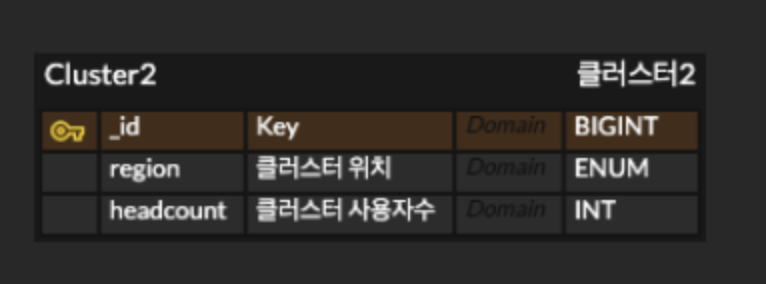
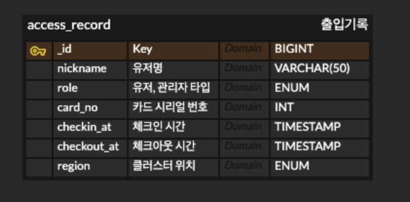

# 데이터베이스 고난기

42 서울 체크인 데이터베이스 스키마를 정의합시다. 스키마를 정의하기 위해서는 ERD를 알고 있어야 합니다.

## ERD 그게 뭐죠?

Entity Relationship Diagram의 약자로서 시스템의 엔티티들이 무엇이 있는지, 어떤 관계가 있는지를 나타내는 다이어그램입니다.

쉽게 설명하자면 하나의 클래스를 만든다고 생각하면 됩니다.

예를 들면 운동하는 공을 정의하기 위해서는 `Ball` 이라는 클래스를 만들고 `speed`, `location` 등을 통해서

공의 위치와 속도를 나타낼 수 있는 것처럼 하나의 객체를 정의하고 어떤 속성을 가지고 있는지를 정의하면 되는 것입니다.

## 서비스에서 ERD?

서비스의 비즈니스를 파악해야 합니다. 제공할 서비스에서 어떤 객체가 있는지 파악을 먼저 해 봅시다.

제멋대로 정의하는 42서울 체크인의 목적은 "코로나 상황"에서의 체크인 간편화 시스템이라고 생각합니다.

- 코로나 확진자(유저)가 발생했을 때 해당 클러스터에 방문했던 사람은 누가 있는지?
- 그러기 위해서 유저가 언제 클러스터에 있었는지?
- 클러스터에 몇 명이 있는지?

와 같은 기능이 주 목적이라고 생각합니다.

그렇다면 여기서 중요하게 보이는 객체는 누가 있을까요? 저는 `유저`, `클러스터`라고 생각합니다.

42서울 체크인에서 활동은 다음과 같습니다.

- 유저가 사이트에 OAuth + Card Number를 통해 "로그인"합니다.
- 유저는 건강 상태를 체크합니다.
- 유저는 "LOG"를 통해, 방문 날짜 및 시각을 알 수 있습니다.
- 유저는 카드 사용을 그만두면서 "체크아웃"합니다.

유저를 **정의해 봅시다**

- 출입기록은 유저의 `체크인 시간`과 `체크아웃 시간`을 가지고 있어야 LOG를 사용할 수 있습니다.

- 유저는 `카드 번호`를 통해 체크인을 할 수 있습니다.

- 관리자 페이지를 위해 `역할` 이라는 개념이 필요합니다.

  - 역할은 ADMIN, STAFF, NONE와 같이 나눌 수 있습니다.

- 42서울 API를 통해 유저의 `닉네임`과 `사진`을 받아옵니다.

  - 이때, 데이터베이스 상으로도 누구인지 확인할 수 있으려면 `닉네임`을 저장하는게 좋다고 생각합니다.

- 데이터베이스에 유저 정보를 기록하기 때문에 유저의 `회원가입 시점`과, `생성 시점`을 알면 좋다고 생각합니다.

**클러스터를 정의해 봅시다.**

- 현재 개포/서초 에서 `몇 명이 사용하고 있는지` 파악해야 합니다.

해당 ERD를 만들면 다음과 같습니다.

### Cluster 엔티티 뭔가 어색한 것 같은데?

위처럼 정의를 하고나니까, 클러스터에서 묘하게 어색한 느낌이 있습니다. 컬럼에서 서초와 개포는 같은 레벨이지만, 아이디와 서초/개포 는 같은 레벨이 아닙니다. 따라서 데이터베이스 스키마관계가 어색하다고 생각합니다.

추가로, 만약 새로운 클러스터가 생긴다면은 데이터베이스를 수정해야 된다는 번거로움이 있어보입니다.

그래서 아래와 같이 바꾸면서 SQL문이 조금 어려워지더라도, 확장성까지 고려할 수 있다고 생각합니다.

### 유저랑 클러스터를 합칠 수는 없을까?

위에도 나쁘지는 않다고 생각하지만, 더 나은 방법이 있을 것 같습니다. 코로나 19에 의한 출입기록이 목적이 맞다면 정말 출입기록 테이블을 만들면 되지 않을까라고 생각을 했습니다.

출입기록과 클러스터를 외래키를 통해서 관리를 할 수 있다고 생각했지만, 그것보다 출입기록 테이블 한 개만 쓰는게 더 관리하기 편해보였습니다.

해당 형태로 만들면, 클러스터에 있던 사람들을 쉽게 파악할 수 있을 것이라고 생각했습니다.

이 데이터베이스로 백엔드 코드를 작성해 볼 예정입니다.
